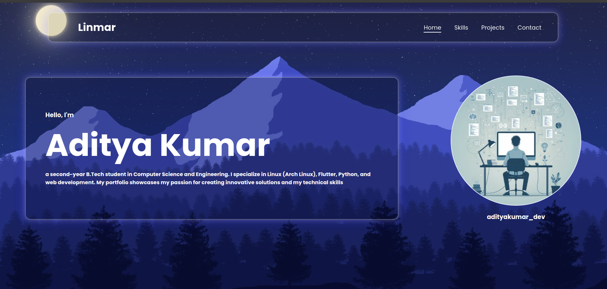

# Portfolio Website

Welcome to my personal portfolio website! This project showcases my skills, projects, and professional experience. It's built using modern web technologies to create a responsive, visually appealing, and smooth user experience.

## Features

- **Responsive Design**: The website adapts to different screen sizes, ensuring a smooth experience on mobile, tablet, and desktop.
- **Smooth Scroll Navigation**: Easily navigate between sections with smooth scrolling animations.
- **Interactive Projects Section**: Showcase of my best projects with links and details.
- **Skills Section**: Highlights of the technical skills I've acquired.
- **Contact Section**: A working contact form where visitors can reach out to me.
- **Navbar Highlight on Scroll**: The navigation bar automatically updates as you scroll through different sections of the page.

## Technologies Used

- **HTML5**
- **CSS3**
- **JavaScript (Vanilla)**
- **Intersection Observer API** (for smooth scrolling and navbar updates)
- **Google Fonts** (for custom typography)
